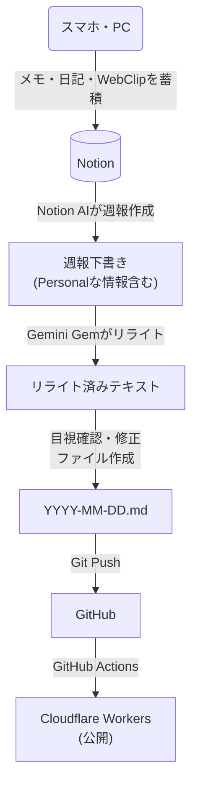

# mm2-blog

個人の備忘録・メモ用ブログです。

## ドメイン情報

このブログは以下のドメインで運用されています：

- **メインURL**: [https://blog.milkmaccya.com](https://blog.milkmaccya.com) (Cloudflare経由)
- **Cloudflare Workers (デフォルト)**: [https://mm2-blog.milkmaccya2.workers.dev/](https://mm2-blog.milkmaccya2.workers.dev/)

## プロジェクトについて

Astroを使用しており、Markdownファイル (`src/content/blog/`) をベースに記事を管理しています。

### ブログ執筆・更新フロー

Notionに蓄積した個人のメモや日記を元にNotion AIが週報を作成し、それをGeminiでリライトして公開しています。



## 開発コマンド

| コマンド | 説明 |
| :--- | :--- |
| `npm install` | 依存関係のインストール |
| `npm run dev` | ローカルサーバー起動 (`localhost:4321`) |
| `npm run build` | 本番用ビルド (`./dist/` 生成) |
| `npm run preview` | ビルド内容のプレビュー |
| `npm run lint` | Biomeでコードチェック |
| `npm run lint:fix` | Biomeでコードチェック＆自動修正 |

## プロジェクト構成

```text
├── .github/workflows/ # CI/CD定義（Lighthouse監視等）
├── docs/              # 開発ドキュメント（実装計画等）
├── public/            # 静的アセット（フォント、favicon等）
├── src/
│   ├── assets/        # ビルド処理されるアセット（画像等）
│   ├── components/    # Astroコンポーネント
│   ├── content/       # 記事コンテンツ (Markdown)
│   ├── data/          # プロジェクト情報などの静的データ
│   ├── layouts/       # ページレイアウト
│   ├── lib/           # ユーティリティ関数
│   ├── pages/         # ルーティング定義
│   ├── styles/        # グローバルスタイル
│   └── consts.ts      # 共通定数定義
├── tests/             # E2Eテスト (Playwright)
├── astro.config.mjs   # Astro設定
├── biome.json         # Biome設定（Lint/Format）
├── tailwind.config.js # Tailwind CSS設定
├── sentry.*.config.js # Sentry（エラー追跡）設定
├── package.json
└── wrangler.json      # Cloudflare Workers設定
```

## 技術スタック

- Astro
- Tailwind CSS
- Biome (Linter/Formatter)
- Lefthook (Git Hooks)
- Sentry (Error Tracking)
- Renovate (Dependency Updates)
- Lighthouse CI (Performance Monitoring)
- Pagefind (Search Indexing)
- Cloudflare Workers (Hosting)

## 環境変数

ローカル開発には `.env` ファイルが必要です。`.env.example` を参考に作成してください。

```bash
cp .env.example .env
```

| 変数名 | 説明 |
| :--- | :--- |
| `PUBLIC_SENTRY_DSN` | Sentryのデータソース名 (DSN) |
| `SENTRY_AUTH_TOKEN` | Sentryの認証トークン (ソースマップのアップロードに使用) |
| `SENTRY_ORG` | Sentryの組織名 |
| `SENTRY_PROJECT` | Sentryのプロジェクト名 |

Cloudflare Pages/Workers でデプロイする場合も、同様の変数をダッシュボードから設定してください。

