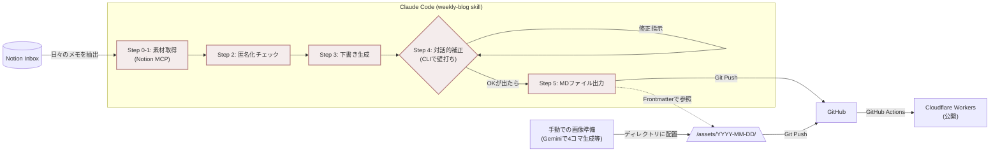

# mm2-blog

個人の備忘録・メモ用ブログです。

## ドメイン情報

このブログは以下のドメインで運用されています：

- **メインURL**: [https://blog.milkmaccya.com](https://blog.milkmaccya.com) (Cloudflare経由)
- **Cloudflare Workers (デフォルト)**: [https://mm2-blog.milkmaccya2.workers.dev/](https://mm2-blog.milkmaccya2.workers.dev/)

## プロジェクトについて

Astroを使用しており、Markdownファイル (`src/content/blog/`) をベースに記事を管理しています。

### ブログ執筆・更新フロー

Notionに蓄積した個人のメモや日記を元にカスタムスキルで下書きを作成しています。


```mermaid
graph LR
    Notion[(Notion Inbox)]

    subgraph "Claude Code (weekly-blog skill)"
        CC_Fetch["Step 0-1: 素材取得<br/>(Notion MCP)"]
        CC_Anonymize["Step 2: 匿名化チェック"]
        CC_Draft["Step 3: 下書き生成"]
        CC_Refine{"Step 4: 対話的補正<br/>(CLIで壁打ち)"}
        CC_Output["Step 5: MDファイル出力"]
    end

    ImageGen["手動での画像準備<br/>(Geminiで4コマ生成等)"]
    Assets[/"/assets/YYYY-MM-DD/"\]
    
    GH[GitHub]
    CF["Cloudflare Workers<br/>(公開)"]

    %% メインフロー
    Notion -->|日々のメモを抽出| CC_Fetch
    CC_Fetch --> CC_Anonymize
    CC_Anonymize --> CC_Draft
    CC_Draft --> CC_Refine
    
    %% CLI上でのやり取りを自己ループで表現
    CC_Refine -- "修正指示" --> CC_Refine
    CC_Refine -->|OKが出たら| CC_Output

    %% 画像の扱い
    ImageGen -->|ディレクトリに配置| Assets
    CC_Output -.->|Frontmatterで参照| Assets

    %% デプロイフロー
    CC_Output -->|Git Push| GH
    Assets -->|Git Push| GH
    GH -->|GitHub Actions| CF

    %% スタイリング
    classDef claude fill:#f4ecec,stroke:#b37b7b,stroke-width:2px;
    class CC_Fetch,CC_Anonymize,CC_Draft,CC_Refine,CC_Output claude;
```

## 開発コマンド

| コマンド | 説明 |
| :--- | :--- |
| `npm install` | 依存関係のインストール |
| `npm run dev` | ローカルサーバー起動 (`localhost:4321`) |
| `npm run build` | 本番用ビルド (`./dist/` 生成) |
| `npm run preview` | ビルド内容のプレビュー |
| `npm run lint` | Biomeでコードチェック |
| `npm run lint:fix` | Biomeでコードチェック＆自動修正 |

## プロジェクト構成

```text
├── .github/workflows/ # CI/CD定義（Lighthouse監視等）
├── docs/              # 開発ドキュメント（実装計画等）
├── public/            # 静的アセット（フォント、favicon等）
├── src/
│   ├── assets/        # ビルド処理されるアセット（画像等）
│   ├── components/    # Astroコンポーネント + chat/ (React)
│   ├── content/       # 記事コンテンツ (Markdown)
│   ├── data/          # プロジェクト情報などの静的データ
│   ├── layouts/       # ページレイアウト
│   ├── lib/           # ユーティリティ関数
│   ├── pages/         # ルーティング定義
│   ├── styles/        # グローバルスタイル
│   └── consts.ts      # 共通定数定義
├── tests/             # E2Eテスト (Playwright)
├── astro.config.mjs   # Astro設定
├── biome.json         # Biome設定（Lint/Format）
├── tailwind.config.js # Tailwind CSS設定
├── sentry.*.config.js # Sentry（エラー追跡）設定
├── package.json
├── wrangler.json      # Cloudflare Workers設定
└── .textlintrc.json   # textlint設定
```

## AIチャットウィジェット

全ページにフローティングチャットウィジェット（💬）を搭載。ブログの内容について質問すると、RAGベースで記事を検索し回答する。

バックエンドは別リポ [`mm2-blog-chat`](https://github.com/milkmaccya2/mm2-blog-chat) に分離されており、ブログ側にはフロントエンド（React island）のみを配置。

| レイヤー | 技術 | リポ |
|---------|------|------|
| フロントエンド | React island (`client:idle`), AI SDK `useChat` | mm2-blog |
| バックエンド API | Cloudflare Worker, Anthropic Claude | [mm2-blog-chat](https://github.com/milkmaccya2/mm2-blog-chat) |
| RAG | Cloudflare Vectorize + Workers AI | [mm2-blog-chat](https://github.com/milkmaccya2/mm2-blog-chat) |

## 技術スタック

- Astro
- Tailwind CSS
- React (チャットウィジェット)
- AI SDK (`@ai-sdk/react`)
- Biome (Linter/Formatter)
- textlint（Improve article text）
- Lefthook (Git Hooks)
- Sentry (Error Tracking)
- Renovate (Dependency Updates)
- Lighthouse CI (Performance Monitoring)
- Pagefind (Search Indexing)
- OGP Image Generation (Satori)
- giscus (Comments)
- Cloudflare Workers (Hosting)

## 環境変数

ローカル開発には `.env` ファイルが必要です。`.env.example` を参考に作成してください。

```bash
cp .env.example .env
```

| 変数名 | 説明 |
| :--- | :--- |
| `PUBLIC_SENTRY_DSN` | Sentryのデータソース名 (DSN) |
| `SENTRY_AUTH_TOKEN` | Sentryの認証トークン (ソースマップのアップロードに使用) |
| `SENTRY_ORG` | Sentryの組織名 |
| `SENTRY_PROJECT` | Sentryのプロジェクト名 |
| `PUBLIC_GISCUS_REPO` | giscus用リポジトリ名 (例: `owner/repo`) |
| `PUBLIC_GISCUS_REPO_ID` | giscus用リポジトリID |
| `PUBLIC_GISCUS_CATEGORY` | giscus用Discussionカテゴリ名 |
| `PUBLIC_GISCUS_CATEGORY_ID` | giscus用DiscussionカテゴリID |
| `PUBLIC_AMAZON_URL` | Amazonアフィリエイトのベースリンク |
| `PUBLIC_RAKUTEN_URL` | 楽天アフィリエイトのベースリンク |
| `PUBLIC_GTM_ID` | Google Tag Manager のコンテナID (例: `GTM-XXXXXXX`) |

Cloudflare Pages/Workers でデプロイする場合も、同様の変数をダッシュボードから設定してください。

