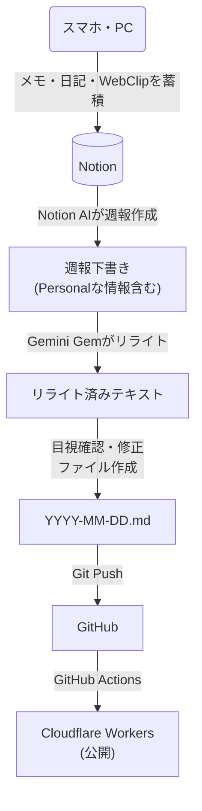

# 変更内容の確認 (Walkthrough)

## 実施した変更

### 1. ブログ執筆・更新フロー図の追加 (`README.md`)
`README.md` に Mermaid 記法を用いて、Notion からブログへの執筆・更新フローを表す図を追加しました。



### 2. プロジェクトページへのブログ追加 (`src/pages/projects.astro`)
`Projects` ページに、本ブログ (`mm2-blog`) の情報を Personal Project として追加しました。

- **Title**: mm2-blog
- **Description**: 個人の雑記ブログ。Notionで書いた記事をAIでリライトして投稿するフローを構築。
- **Tags**: Astro, Tailwind CSS, Cloudflare Workers, Notion API

## 検証結果

### ビルド確認
`npm run build` コマンドを実行し、正常にビルドが完了することを確認しました。

```text
10:28:58 [build] 14 page(s) built in 1.88s
10:28:58 [build] Complete!
```
