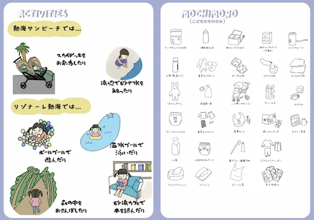
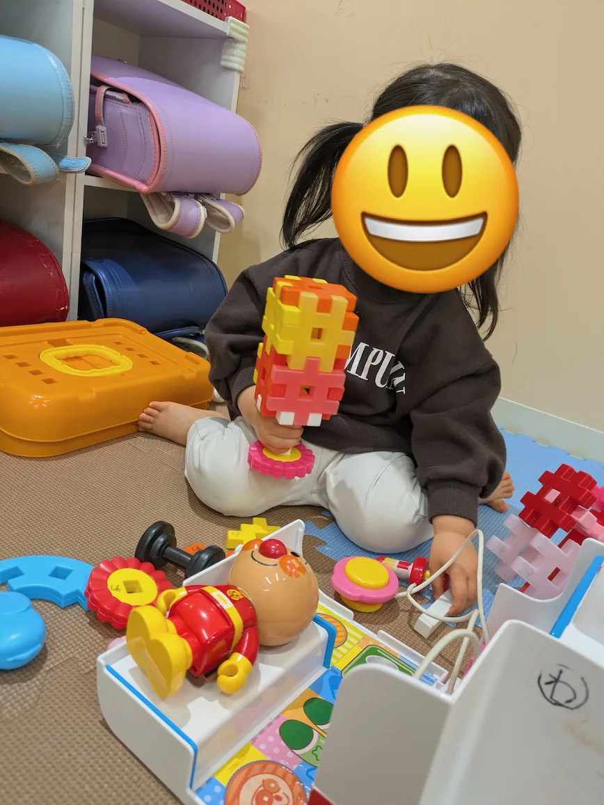
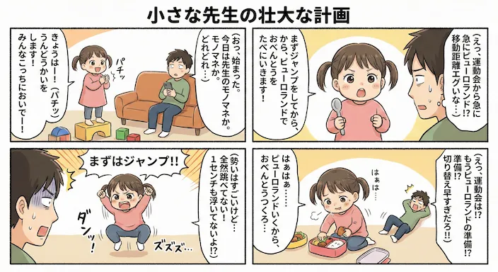

## 今週のハイライト

家族全員で星野リゾートの「リゾナーレ熱海」へ行き、初の"家族全員旅行"を無事にやり遂げた。祖父母の強力なサポート、そして何より妻の頑張りに大いに救われ、久しぶりに美味しいお酒と食事を堪能してバタバタではあったがちゃんと休みもとれたと実感できた充実の週だった。

## 家族・生活

### リゾナーレ熱海での初・家族全員旅行

家族全員で星野リゾートの「リゾナーレ熱海」へ足を運んだ。これが我が家にとって初の家族全員旅行である。道中や滞在中は、祖父母のヘルプ、そして妻の多大なるサポートに本当に感謝している。案内された部屋は想像以上に広く、丘の上からの展望も申し分なかった。夜のビュッフェは海の幸が大当たりで、久しぶりに夕ご飯にお酒（エールビールやハイボール）を飲むことができ、心から「ちゃんと休めた」という感覚を味わえた。みんな眠ってからの晩酌以外で呑んだのは何ヶ月ぶりか。。二日目も朝食のクオリティが高く、特に鯛ご飯が絶品だった。長女（2歳）は甘いものを大量に食べていたが、今回は旅行モードということで良しとする。

妻お手製のしおり

また、熱海サンビーチにも立ち寄った。長女（2歳）にとっては初めての海だったが、犬へのトラウマからギャン泣きしてしまい、楽しめなくて残念だった。大人と双子は楽しめたが。

### スマホの通知と勝手に走る疑心暗鬼

旅行に向かう車中でのことだ。たまたま妻のスマホ画面が目に入り、「家の査定（売却？）」らしき不在連絡の通知を見てしまった。正直なところ、驚きとショックで思わずフリーズし、疑心暗鬼が一気に湧き上がってしまった。「自分のローンで買っているのに」「そんなにこの家が嫌なのか」「まさか離婚時の財産分与を調べているのか」などと、よくない想像が勝手に頭の中を駆け巡る始末。非常に心臓に悪い出来事であった。

### 長女（2歳）と二人きりの「わぴあ」

久しぶりに長女（2歳）と朝から二人で「わぴあ」へ出かけた。一日がっつり遊べて嬉しい反面、「育休が終わる前の今、こうやって丸一日一緒にいられるのも最後かもしれない」と思うとしんみりしてしまった。以前なら夕方にはクタクタになっていたはずだが、最近続けている筋トレの成果か、夕方でもまだ動ける余力が残っており、確実に体力がついていることを実感できた。この後に控える夜勤担当に向けても「ここから頑張るぞ」という気合いが入った。

いつも間にか作っていたブロックで作ったアイス

### 寝室の急な運用変更と睡眠不足

「みんな同じ部屋で寝る」という計画は3月になるまで延期していたはずが、急に流れが変わって実行モードに突入した。思いつきで予定を変えられると、地味にストレスが溜まるものである。さらに、ダブルベッドに「大人二人＋長女（2歳）」という布陣は現実的に厳しすぎた。夜中に長女に蹴られまくって何度も目を覚まし、正直ブチギレ案件であった。「ちょっと考えなくてはいけない」というのが今週の切実なメモである。本日は急遽布団を追加して再チャレンジする予定だ。

### 筋トレの記録更新

風邪で一度休んでいた筋トレに無事復帰した。ベンチプレス55kg×11回の後、60kg×6回という新記録が出て素直に嬉しい。やはり数字として記録が伸びると、次週もちゃんと続けようというモチベーションに直結する。10回チケットを購入して現在7回消化した。今月中に使い切りたかったが、体調不良もあって叶わなそうだ。

### その他メモ

花粉が飛び始め、しんどい時期に突入した。睡眠の質にも響くので早めに対策をしておきたい。

最近の長女（2歳）のネイティブ風な英語（「Takoya↑ki」）や先生のモノマネが相変わらず可愛らしく、運動会やお弁当の想像に飛ぶ感じも含めて、疲れていてもふと笑わせてくれる。これが今の生活のリアルな癒やしである。

Nano Banana Proで作成した4コマ漫画

## 技術・インプット

今週の技術メモ（クリックで折りたたみ）

### エージェント前提の開発スタイル

育休中のため業務に直結するトピックは少ないが、記事などを読んでいると「エージェント前提の開発が当たり前になっていく」という空気感をひしひしと感じた。「もうプログラミングを楽しんでる場合じゃねぇ」という焦りと、開発の当たり前が根本から変わっていく流れを実感している。

https://kumagi.com/blog/ja/posts/time-to-software-engineering

### Claude Codeのマーケティング運用事例

Anthropic社内のマーケティングチームがClaude Codeをガチ運用している事例がかなり刺さった。非エンジニアが中心のチームであっても、サブエージェント分割やMCP、メモリ設計を駆使して成果を出しているのは圧倒的に強い。

https://izanami.dev/post/b56cafbc-4d8d-477a-8629-b5ef70282f2b

### AIプロダクトの品質担保

AIプロダクトの品質をどう守るかという観点のスライド資料を「後で読む」に積んだ。復帰後の改善テーマの整理に大いに役立ちそうだ。

https://speakerdeck.com/matsu802/aipurodakutonopin-zhi-wodoushou-ru

### npm publishのTrusted Publishing対応

気になっていたnpm publishの自動化周りで、Trusted Publishing対応を進めた。トラブルシュートも含めて手順を明確化し、メモとして残せたのは良い収穫だった。

https://github.blog/changelog/2025-07-31-npm-trusted-publishing-with-oidc-is-generally-available/

## 今週の買い物

### FAT ボトム（ファッション）

**何のために買った：** 夏前に向けて、ストリートっぽいワイドパンツ枠

**使ってみてどうだった：** 硬めの生地と大きいポケットが好みに刺さる。履くのが楽しみだ。

**満足度：** ★5 とても満足

### AURALEE ボトム（ファッション）

**何のために買った：** 薄めの生地で、考えていたコーデを試したくて。

**使ってみてどうだった：** 裾の縫いがギザギザなのが少し気になる。まずは履いて様子見し、必要ならお直しに出す。

**満足度：** ★3 ふつう

---

## 振り返り

今週はリゾナーレ熱海への旅行で「楽しかった」という確かな手応えがあった一方で、妻のスマホで見えた家の査定通知によるショックと疑心暗鬼、そして寝室運用の突発的な変更による睡眠不足の限界など、心がザワつく要素もあった1週間であった。

来週は「睡眠が崩れない寝方」を優先して見直す。パーソナルトレーニングについては、復職後にどのくらい余白が生まれるか感触をつかんでから、続けるかどうかを改めて考えたい。

そして、いよいよ3月から育休が終わり、仕事への復帰が待っている。「最後の1週間をちゃんと楽しむ」ことと、「復職に向けた心の準備を進める」ことをうまく両立させていきたい。あれもこれもとやることを増やしすぎず、生活リズムと家族オペレーションの土台をしっかりと固めながら、気持ちよく仕事に復帰できる状態へとコンディションを整えていく。