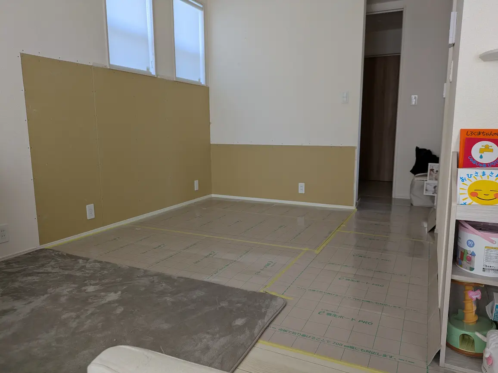
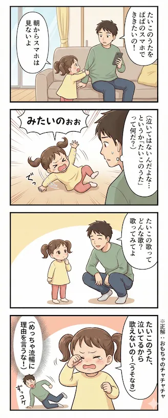

## 今週のハイライト
育休最終週。3月2日の復帰を前に、家のリフォームが日曜をもって無事完了した。生活空間が整うのと並行して、今週から始めたnoteでの発信も少しずつ記事が増えてきて、良いリズムが生まれている。完璧とはいかないまでも、「この期間、自分なりにやってきた」という静かな手応えを感じながら、明日からの復帰に備えたい。

## 家族・生活
### ステップスペースのリフォーム完了
自宅のステップスペースを中心としたリフォーム工事が、この日曜でようやく形になった。解体から養生、そして完成へと至る数日間は落ち着かない面もあったが、空間が新しくなったことで気持ちに一つの区切りがついた。復帰前に住環境を整えられたのは、素直に嬉しい。

<figcaption class="text-center text-sm text-gray-500 dark:text-gray-400 -mt-4">あとは壁紙だけ</figcaption>

### noteでの発信と双子の記録
今週からnoteでの発信を初めた。双子の兄のヘルメット治療に関する記事や、双子エピソードのマガジン化など、少しずつコンテンツが積み上がってきている。育児の合間を縫っての作業だが、自分の経験を言語化する作業は意外と楽しく、復帰後も細く長く続けていければと思っている。

https://note.com/milkmaccya2

### 長女と歩く、石神井公園の春
長女と二人で石神井公園へ。一緒におやつを食べ、季節の移ろいを感じながら過ごす時間は、育休中ならではの穏やかなひとときだった。花粉の気配に体調のリアルを突きつけられつつも、彼女の成長を間近で見守れる尊さを改めて実感した一日。

### 多胎児ひろばでの「外」との接点
地域の「多胎児ひろば」に足を運び、外の世界との接点を持てたのも良かった。双子の兄に人見知りの兆候が見られたのが印象的で、家の中だけでは気づけない子供たちの成長のグラデーションに触れることができた。

### パーソナルトレーニングの進捗
体づくりもマイペースに継続中。今週はベンチプレスで60kg×9回と、数字の上では少しずつ更新ができている。体重や体脂肪率にも変化が出ている（トレーナーに褒められた）、無理のない範囲でこの習慣を維持していきたい。かなり体力がついた実感がある。

## 技術・インプット

今週の技術メモ（クリックで折りたたみ）

### Claude Codeのトークン制限対策とMCPツール導入
生成AIを開発フローに組み込む際、避けて通れないトークン制限。MCP（Model Context Protocol）ツールの導入やスペック駆動開発など、いかに効率的にコンテキストを渡すかの知見を深めた。

### 生成AI活用によるPRレビュー改善事例
AIによるプルリクエスト（PR）レビューの自動化や質向上の事例をキャッチアップ。コード品質の担保と速度の両立は、復帰後のフロントエンド開発でも即座に活用したい領域だ。

### CLAUDE.mdによる開発ルールの事前共有
プロジェクト固有のルールや計画を.mdファイルに集約し、AIエージェントに事前学習させる手法。サブエージェントを効率的に動かすための「指示の構造化」は、もはや必須スキルだと感じる。

### ターミナル環境の移行：Ghosttyからcmuxへ
作業効率とワークスペース管理の最適化を狙い、ターミナル環境をGhosttyからcmuxへ移行。復帰後のマルチタスクを支える基盤を整えた。

## その他

今週の4コマ

<figcaption class="text-center text-sm text-gray-500 dark:text-gray-400 -mt-4">たいこのうた</figcaption>

## 振り返り
工事の対応、育児、合間の手続き、そしてnoteの執筆。振り返れば密度の高い一週間だったが、家の整理が進んだり発信が形になったりと、「前に進んでいる」感覚は得られた。

そして、いよいよ育休が終わる。明日、3月2日から仕事復帰。
この期間、毎日の細かい積み重ねを続けてこれたことは、自分の中で大切にしたいと思う。

来週は復帰初週。まずは「慣らし」のつもりで、以下の3点を意識して過ごす。

- 予定を詰めすぎない
- 睡眠を削らず体力を優先する
- 焦らずに仕事の勘を取り戻す