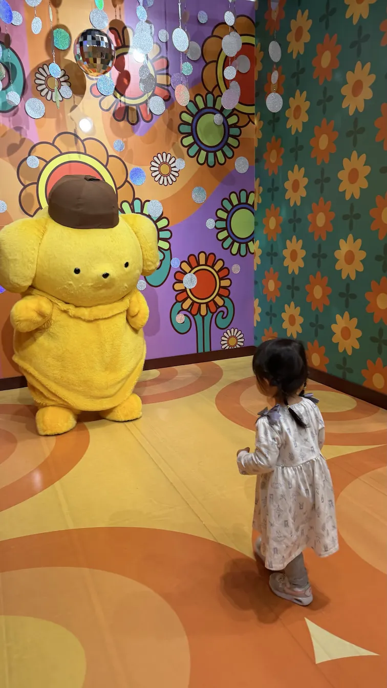
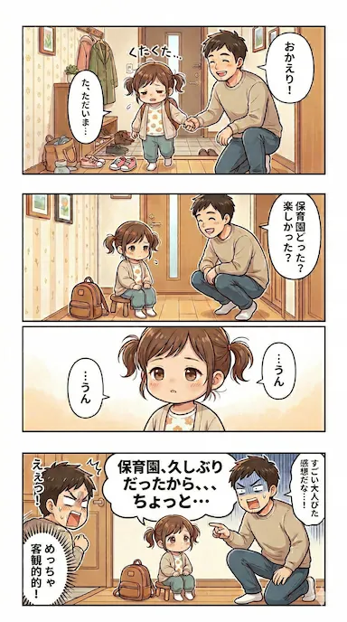

## 今週のハイライト
育休からの復帰初週。久々の出社で仕事の勘を取り戻しつつ、Claude Codeを駆使して重要プロジェクトのプロトタイプを週末までに作り切った。また、ClaudeのProject機能を活用してメモから短時間で下書きを練り上げるワークフローが確立し、note記事を量産できる執筆フローが整ったのも大きな成果だ。

## 家族・生活

### 「おおきくなったねの会」での感慨
保育園で行われた「おおきくなったねの会」に参加した。長女（2歳）の発表を見たり、記念カードをもらったりする中で、家庭内とはまた違うコミュニティでの確かな成長を感じることができた。4月からは卒園して保育園を去っていく子もいるため、子供たちの成長の早さを思い、より一層感慨深い良い節目になった。

### 双子の朝のミルクと、イレギュラーな朝食当番
双子の朝のミルクは、自分が担当することになっている。双子の弟が早起きした日も、淡々とミルクをあげて対応した。ただ、この日は妻が寝ていたため、そのまま自分が朝ごはんを作ることに。普段の朝ごはんは妻が作ってくれているため、「今、自分が朝ごはんを作っている」という状況に、復帰直後の脳が少し戸惑う瞬間もあった。とはいえ、こうして臨機応変にカバーし合えるのは良いことだ。

### 念願のピューロランドと、ぷりんちゃん
平日にばあばに来てもらい、長女は3回目となるサンリオピューロランドへ遊びに行った。自分は仕事のためお留守番だったが、前回は当日券が売り切れていて入れなかった念願のポムポムプリン（ぷりんちゃん）に会えたようで、大喜びしている様子を聞いて自分も嬉しくなった。

<figcaption class="text-center text-sm text-gray-500 dark:text-gray-400 -mt-4">念願のぷりんちゃん</figcaption>

### 紛失した手袋の行方
出社日に自転車で移動中、お気に入りの手袋を落としてしまった。半ば諦めていたのだが、最終的に「汚れ物袋」の中から無事発見された。バタバタとした日常の中でのケアレスミスだが、見つかって素直にホッとしている。

## 技術・インプット

今週の技術メモ（クリックで折りたたみ）

### コードレビューにClaude Codeのsubagentsを導入してレビュー品質が改善した話（Zenn）

https://zenn.dev/mgdx_blog/articles/8f7994ad84151d

Claude Codeのsubagentsを活用することで、レビューの粒度が一段上がった。AIを単なるチャット相手ではなく、多角的な視点を持つエージェントとして組み込む有効性を再確認した。

### 個人的なAI情報の追い方（Zenn）

https://zenn.dev/knowledgework/articles/my-ai-catchup

情報の濁流に飲まれないための、自分なりのフィルタリング術。復帰後もキャッチアップを継続するため、発信の仕組み化は必須だと感じている。

### skill-creatorから学ぶSkill設計とOrchestration Skill

https://nyosegawa.github.io/posts/skill-creator-and-orchestration-skill/

Orchestration Skillの設計思想は、現在のプロトタイプ開発にも直結する内容だ。

### 古くなったダウンは捨てないで！（ねとらぼ）

https://news.yahoo.co.jp/articles/a98f29cc0c5005b4fc606b66c3111558fdb47654

古いダウンをPCバッグにリメイクするというアイデア。ガジェットを保護するクッション性として理にかなっており、面白かった。

## その他

今週の4コマ

<figcaption class="text-center text-sm text-gray-500 dark:text-gray-400 -mt-4">久しぶりの保育園</figcaption>

## 振り返り
育休復帰初週として、生活動線と仕事の勘を取り戻しながら、重要プロジェクトのプロトタイプまで作り切ることができた。久しぶりに同僚と会えて、歓迎ムードを感じられたのは素直に嬉しかった一方で、組織がかなり流動的になっていたことには驚きもあった。とはいえ、組織内のキーパーソンとはすでにしっかりと会話ができているので、この調子で状況をキャッチアップしつつ頑張っていきたい。

また、Claudeを活用してnote記事を量産できる仕組みが機能し始めたのは、今後のアウトプットにおいて大きなアドバンテージになりそうだ。毎日の生活は育休前よりも確実にタスクが増えている実感があるが、それでも粘り強くやれている。妻の負担が増えている中で協力してもらっていることに、改めて感謝したい。

来週はプロトタイプの持参・レビューを通して次の打ち手を確定させつつ、復帰後のルーティン（通勤、朝夕の段取り）をもう一段安定させていくつもりだ。
