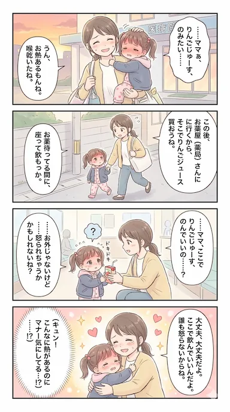

## 今週のハイライト

子ども3人が同時に体調を崩した。双子は胃腸炎、長女（2歳）はヒトメタニューモウイルス。階を分けて隔離し、妻とばあばに助けてもらいながらなんとか乗り切った1週間。仕事も本格的に動き出し、疲労と充実が入り混じる日々だった。

## 家族・生活

### 子ども全員ダウン、階を分けての隔離生活

週の始まりから双子が胃腸炎にかかった。双子の弟が離乳食とミルクを全部吐き、背中漏れの下痢。双子の兄も同じ症状が出て、2人揃ってダウンした。1日中看病していると、さすがに疲れる。

さらに長女にも熱と咳が出て保育園を休むことに。病院を受診したところヒトメタニューモウイルスと診断された。幸いインフルエンザではなかったが、双子への感染を避けるため、双子と自分が1階、長女と妻が2階という隔離体制を敷いた。

ばあばが朝から駆けつけてくれて本当に助かった。妻とばあばの看病に感謝しかない。

### 夜のミルクと、起き上がれない夜

今週はリビングで双子と一緒に寝る生活だった。ある夜、最後のミルクをあげ忘れて寝落ちしてしまい、妻が代わりに起きて対応してくれた。仕事の疲れが溜まっていたのと、みんなが寝た後も深夜まで作業していたのが重なって、身体が動かなかった。申し訳ないと思いつつ、助かった。

### 回復の兆し

週の後半、長女は鼻血が出たり食事中に嘔吐したりとまだ本調子ではないものの、よく眠れるようになった。双子も下痢は続いているがミルクの飲みは徐々に戻りつつある。完全回復とまではいかないが、峠は越えた感覚だ。

## 仕事・キャリア

### 復帰後のワクワク感

仕事がいろいろ動き出している。育休前は余裕がなかったんだなと、復帰してみて改めて思う。全社ミーティングが面白いと感じられるのは、インプットの余裕ができて周辺情報を吸収できるようになったからだろう。自分ごととして捉えられるテーマがあると、自然とワクワクする。

### 構想と現実のバランス

仕事の構想を話していると、つい技術的な解決策ばかりに頭が向いてしまう。理想を膨らませすぎると、AIを使っても実装量が膨大になる。規模は抑えたい。一方で、重要な場面でも使われる予定があるので、ちゃんと仕上げたいという気持ちもある。

その分、妻への負担が増すことへの申し訳なさはある。やりたいこと・やらないといけないことがあるのに、まだ十分に進められていない不甲斐なさも感じている。ただ、無理せずバランスを大事にしたい。焦っても仕方がない。

## 技術・インプット

今週のインプット一覧（クリックで展開）

### ブログ用AIエージェントの構築

自分のブログにNotionのメモや過去の投稿、Aboutページなどをデータソースとして組み込み、CloudflareのVectorizeとGitHub Actionsを使ってAIエージェントを自動運用する仕組みを構築した。先週の「構想段階」から一気に実装まで持っていけた。全体的にはいい感じだが、Safari系のブラウザ（iOS含む）でキャッシュクリアがうまく機能していない可能性があり、動作確認が必要。

### AIエージェント開発時のモデル選定とアーキテクチャ

ブログ用AIエージェントの設計にあたり、Geminiで壁打ちしながらモデル選定やアーキテクチャを検討した。どのモデルをどの用途に使うか、コストと性能のバランスをどう取るかなど、実装前の整理として有用だった。

### Claude Codeで20年前の商用ゲームをブラウザ移植した話

2003年リリースのWindows専用オンラインTPS「GunZ: The Duel」を、WebAssemblyとWebGLでブラウザ上に完全移植したという記事。Direct3D 9の描画命令をリアルタイムでWebGLに変換する翻訳レイヤーを作成し、ゲームコード自体はほぼ無改変。サーバーもWASM化してWeb Worker上で動作させている。Google AntigravityとClaude Codeを活用し、人間では数年規模の作業を約3週間で完了させたとのこと。

「ゲームコードを書き換えるのではなく、APIの翻訳レイヤーを挟む」という発想が鮮やかだった。AIコーディングの活用事例としても、規模感と成果のギャップが印象的。

https://qiita.com/LostMyCode/items/7597edb999821efd2d8b

## その他

### 意図せず断酒していた

気づけば3/13から1週間以上お酒を飲んでいない。家族が体調を崩していたのもあるが、意図せず生活が変わっていた。YouTubeで時間を潰すことも減り、代わりに仕事やブログに時間を使うようになった。noteとブログという新しい趣味が加わったことで、飲酒が自然と減った。悪くない変化だと思う。

### 三連休とサウナ

三連休は家にいながら合間にAIへの指示出しや実装を進めていた。土曜日はばあばが来てくれたので、朝霞のなごみへサウナに行った。土曜限定の熱波師によるロウリュが久しぶりで、6段ひな壇サウナの熱気をたっぷり食らった。仮眠室で休んで、松屋でスタミナ豚バラ定食を食べて帰宅。

帰りの車でラジオを聞いていたら、旅行の話や大林素子のゲスト出演など、普段は子どもと仕事で頭がいっぱいな自分には新鮮な刺激だった。

### 筋トレと最後のパーソナル

仕事が始まってから筋トレができていない。休みが取れないのもあり、土日しか時間が取れない。日曜に最後のパーソナルトレーニングを控えているが、前回から3週間ほど空いてしまった。本当はその前に1回自主的にジムへ行きたかった。筋力の低下感と肩こりのひどさが気になる。

### 今週の4コマ

<figure>

<figcaption class="text-center text-sm text-gray-500 dark:text-gray-400 -mt-4">リンゴジュース</figcaption>

</figure>

---

## 振り返り

子どもが3人同時にダウンするという、なかなかハードな1週間だった。看病しながら仕事、仕事しながら深夜にブログ。体力的にはきつかったが、不思議としんどさよりも充実感が勝っている。

仕事ではワクワクできるテーマに出会えたし、ブログのAIエージェントも形になった。意図せずお酒をやめていたのも、生活が前向きに変わっている証拠なのかもしれない。

来週は子どもたちの完全復活を祈りつつ、仕事もブログも無理のないペースで。全部やろうとしない。それだけ意識していれば十分だろう。
